# Project Report: Census Income Classification and Customer Segmentation

**Prepared for:** Retail Business Client | **Date:** March 2026

---

## 1. Executive Summary

The client needs to distinguish high-income (above $50K) from lower-income individuals for marketing purposes, and to understand what natural groupings exist within their customer base.

I approached this as two connected problems: first, build a prediction tool that classifies income tier from demographic data; second, discover meaningful customer segments that inform targeted marketing strategies.

**Key results:**
- The best classifier (XGBoost) achieves 96% accuracy, but the real value comes from understanding *why* — occupation, weeks worked, and education are the strongest drivers.
- The segmentation reveals three distinct groups — working-age adults, retirees, and dependents — each requiring fundamentally different marketing approaches.
- High-income individuals concentrate almost entirely in one segment, which has clear implications for how the client allocates marketing resources.

---

## 2. How I Approached the Data

### 2.1 First Look: Understanding What I Was Working With

Before building any models, I needed to understand the data's structure and challenges. The dataset has **199,523 census records** with 40 demographic and employment variables, an instance weight (sampling representation), and an income label.

The first thing that jumped out was the **severe class imbalance**: 93.8% of people earn below $50K and only 6.2% earn above. This shaped my entire approach — a naive model that simply predicts "<$50K" for everyone would score 93.8% accuracy while being completely useless. So accuracy alone can't be my success metric; I need to evaluate precision and recall on each class separately.

The second issue was that 28 of 40 features are categorical text variables. After one-hot encoding (the safest approach — makes no ordering assumptions), the feature space expands from 40 to **380 columns**. This creates a dimensionality problem for clustering, which I address with PCA later.

Third: only one variable (`hispanic origin`) has missing values — 874 out of 199,523 records (0.4%). I filled these with "Unknown" rather than drop rows or impute with the most common value. In banking risk, non-disclosure often carries its own signal — someone who didn't answer may have a different profile than someone who did. An explicit "Unknown" category lets the model decide whether that matters.

### 2.2 A Deliberate Choice: Risk-Oriented Framing

I mapped the label so that `<$50K = 1` (positive class) and `>=$50K = 0`. This wasn't arbitrary — it's a **business decision**. By making lower income the "positive" class, every positive coefficient and every high-importance feature points toward risk. This mirrors how banks think: predict the adverse outcome (default, fraud, low income), so every signal the model surfaces is a "red flag." Flip it the other way and the model finds "green flags" instead. Same math, completely different business interpretation.

### 2.3 Feature Retention and Class Imbalance

I retained all 40 features — tree models ignore uninformative ones naturally, and the full feature space lets clustering discover unexpected groupings. For the class imbalance (93.8% vs 6.2%), I used `class_weight='balanced'` across all models to penalize minority-class errors without altering the data itself.

---

## 3. Classification: A Three-Stage Approach

### 3.1 Why Three Models?

I didn't pick three models randomly. Each one answers a question the previous one couldn't:

**Stage 1 — Random Forest: "Can I predict this, and what matters?"**
When facing a new problem, the first question is whether the signal exists at all. RF is the ideal starting point: it handles mixed data types, requires no preprocessing, and rarely fails badly. It gave us an 85% accuracy baseline and — critically — a ranked list of important features. But RF can only tell us *that* education matters, not *how*. Does a bachelor's degree increase or decrease income probability? By how much?

**Stage 2 — Logistic Regression: "In which direction does each feature push?"**
This gap is what motivated LR. Its signed coefficients show that weeks worked (-0.87) is the strongest protective factor, while "nonfiler" tax status (+0.78) is a strong risk flag. A bachelor's degree has coefficient -0.58, meaning it pushes toward higher income. This directional insight is what the client actually needs — not just "education matters" but "more education = higher income, and here's how much." That said, LR assumes a linear relationship. Real income drivers interact in complex ways (the effect of education depends on occupation), which limits LR's accuracy.

**Stage 3 — XGBoost: "What's the best prediction I can achieve?"**
With the data understood (RF) and relationships mapped (LR), I pushed for accuracy. XGBoost's sequential error correction targets the hardest boundary cases — people near the $50K line — and reaches 96% accuracy.

### 3.2 What the Results Tell Us

RF and LR both reach 85% accuracy; XGBoost reaches 96%. Yet the AUC scores are remarkably close — 0.937, 0.941, and 0.950 respectively ([Figure 1](#fig1)). All three models *rank* people similarly well; the difference is in where they draw the classification line. This means the client could use XGBoost for scoring and adjust the threshold based on campaign goals.

**The business tradeoff:** RF with balanced weights says "don't miss anyone" (87% recall, 27% precision). XGBoost says "be precise when you flag someone" (42% recall, 76% precision). The right choice depends on campaign economics — is it worse to miss a high-income customer or to waste a premium offer on someone who doesn't qualify?

### 3.3 What Drives Income?

The top predictors ([Figure 2](#fig2)) are occupation recode (0.089), number of employers (0.072), age (0.068), weeks worked (0.060), and tax filer status (0.053). The pattern is clear: **employment participation dominates**. Several "not in universe" categories (meaning the person isn't in the labor force) rank highly — people who don't work tend to earn less. This has an important implication I revisit in the segmentation section.

Logistic Regression adds directionality:
- **Risk factors** (push toward <$50K): No occupation (+1.93), nonfiler status (+0.78), not in labor force (+0.40)
- **Protective factors** (push toward higher income): Weeks worked (-0.87), capital gains (-0.78), age (-0.69), bachelor's degree (-0.58), male (-0.58)

The gender gap (-0.58 for male) reflects 1994-1995 patterns. The strongest single protective factor is simply working more weeks per year.

### 3.4 Education: The Clearest Predictor for the Client

[Figure 3](#fig3) is probably the most actionable finding for the client. Professional degrees (MD, JD) and doctorates reach 52-54% high-income rates. A bachelor's degree alone reaches 19.7% — nearly five times the high school rate of 3.9%. Below high school, rates drop below 2%. Education is the single most interpretable and actionable predictor in the dataset.

### 3.5 Where the Model Gets It Wrong

The confusion matrix ([Figure 4](#fig4)) shows XGBoost correctly classifies 37,105 low-income and 1,050 high-income individuals. The 1,426 false positives (high-income flagged as low-income) are missed premium opportunities — the client sends value offers to someone who could afford premium products. The 324 false negatives are costlier — sending premium offers to people who can't afford them, potentially causing frustration. The model errs conservatively, which is appropriate for marketing.

---

## 4. Segmentation: Discovering Who's in the Data

### 4.1 Method: K-Means with PCA

I chose K-Means for its scalability to 200K records, interpretable centroids (an "average customer profile" per segment), and clean non-overlapping group assignments. However, 380 encoded features is too many for distance-based clustering — in high dimensions, all distances converge. PCA compresses to 213 components retaining 90% of variance ([Figure 5](#fig5)), giving K-Means meaningful distances to work with.

### 4.3 Choosing k=3: Data + Business Judgment

The silhouette analysis ([Figure 6](#fig6)) peaks at k=3 (score 0.074). These scores are low — typical for high-dimensional mixed-type data. The clusters exist but aren't tightly separated. I went with k=3 because it balances statistical evidence with business practicality: fewer than 3 segments is too coarse; more than 5 becomes unmanageable for campaign targeting.

### 4.4 The Surprise: 27% of the Data is Children

The segment distribution ([Figure 7](#fig7)) and comparison dashboard ([Figure 8](#fig8)) reveal three distinct groups. The 2D projection ([Figure 9](#fig9)) shows their spatial separation.

| Characteristic | Seg 0: "Retirees" (23.8%) | Seg 1: "Dependents" (26.9%) | Seg 2: "Workforce" (49.3%) |
|---------------|:------------------------:|:---------------------------:|:-------------------------:|
| **Avg age** | 55.8 | 8.0 | 38.7 |
| **Weeks worked/yr** | 3.8 | 0.3 | 45.0 |
| **Avg capital gains** | $228 | $1 | $771 |
| **% earning >$50K** | 1.9% | 0.0% | **11.7%** |
| **Education** | High school grad | Children | High school grad |
| **Employment** | Not in universe | Not in universe | Private sector |

The biggest surprise was Segment 1: average age 8, education listed as "Children," zero employment activity. Over a quarter of the dataset is minors. This is the implication I flagged in Section 3.3 — the classifier's "not in universe" features dominate because they're separating children and retirees from workers. The 96% accuracy includes these trivially easy cases; the real challenge is distinguishing income *within the working population*.

### 4.5 What This Means for Marketing

**"Workforce" (49.3%):** The primary target. 11.7% are high-income — use the classifier to identify them within this segment for premium offers (credit cards, mortgages, investment advisory). Digital channels for this working-age group.

**"Retirees" (23.8%):** Different financial needs entirely. They have moderate investment income ($386 avg dividends) but almost no earned income. Products: wealth preservation, estate planning, retirement income. Channels: direct mail, in-branch, phone.

**"Dependents" (26.9%):** Not direct targets, but they signal household composition. A household with dependents has different financial needs (education savings, family insurance). Target through parent/guardian accounts.

### 4.6 Going Deeper: Workforce Sub-Segmentation

Since children and retirees are trivially below $50K, I re-ran clustering on the **workforce only** (age >= 18, weeks worked > 0) — 100,445 records. The workforce dashboard and 2D projection ([Figures 10-11](#fig10)) show the results.

The workforce splits into two groups with a silhouette score of 0.40 — **5x better** than the full-population score (0.074). Removing non-workers produces much cleaner, more meaningful clusters:

- **Younger workers** (8.7%): Avg age 32.8, 43 weeks/year, 6.6% high-income
- **Established workers** (91.3%): Avg age 39.9, 45.6 weeks/year, 12.2% high-income

The established workers are the primary target for premium products — older, more weeks worked, higher capital gains, and nearly double the high-income rate.

---

## 5. Synthesis and Honest Limitations

**Connecting the dots:** The classification and segmentation results reinforce each other.
The classifier's dominant features ("not in universe" categories) directly correspond to
the segmentation's discovery of children and retirees as distinct groups. This means the
two models are seeing the same underlying structure — employment participation is the
fundamental divider in this population. The practical implication: combine both tools by
first segmenting customers, then applying the classifier within the workforce segment for
precise income targeting.

**Limitations:** The 1994-1995 data may not reflect current patterns — the $50K threshold, gender dynamics, and industry composition have changed significantly.

---

## 6. Questions for the Client

1. **What is the cost of each error type?** The classifier can be tuned for recall or precision. The optimal threshold depends on campaign economics — what does a wasted premium offer cost vs. a missed high-value customer?

2. **Should children and retirees be excluded?** They inflate the classifier's accuracy to 96%. Does the client need to classify everyone, or only working-age adults?

3. **Is the $50K threshold still relevant?** Adjusted for inflation, $50K in 1995 is roughly $100K today.

4. **Does the client have transaction-level data?** Behavioral data (spending patterns, transaction frequency) would dramatically improve both models.

5. **How will the segments be operationalized?** This affects how many segments are practical and whether finer granularity is needed within the workforce.

---

## 7. Recommendations

**Deploy now:**
- XGBoost as the primary classifier; LR coefficients for explainability.
- Focus premium marketing on the workforce segment; use the classifier within it to identify high-income individuals.

**Next iteration:**
- Workforce-only classifier, ordinal encoding for education, cross-validation, hyperparameter tuning.

**At scale:**
- Replace one-hot encoding with target/frequency encoding, embeddings, or LightGBM native categoricals.
- Explore RNN/Transformer and GNN approaches if transaction or relational data becomes available.
- Set up model monitoring — income distributions shift over time.

---

## 8. References

1. Kohavi, R. (1996). "Scaling Up the Accuracy of Naive-Bayes Classifiers." *KDD*.
2. Breiman, L. (2001). "Random Forests." *Machine Learning*, 45(1), 5-32.
3. Chen, T. & Guestrin, C. (2016). "XGBoost: A Scalable Tree Boosting System." *KDD*.
4. UCI ML Repository — Census-Income (KDD) Dataset.
5. Scikit-learn documentation. https://scikit-learn.org/stable/
6. Pedregosa, F. et al. (2011). "Scikit-learn: ML in Python." *JMLR*, 12, 2825-2830.

---

## Appendix: Figures

| **Fig 1.** ROC Curves | **Fig 2.** Feature Importances | **Fig 3.** Education vs Income |
|:---------------------:|:------------------------------:|:-----------------------------:|
| 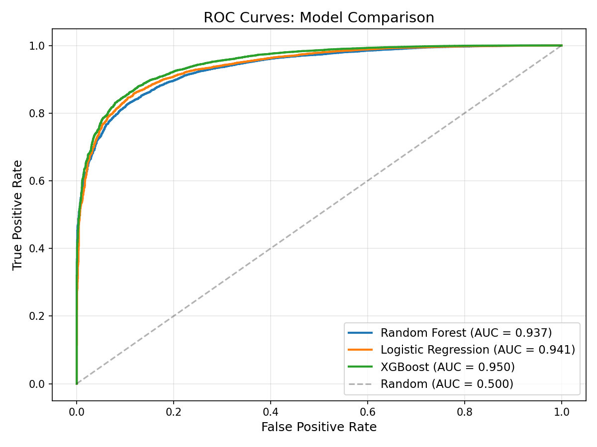 | 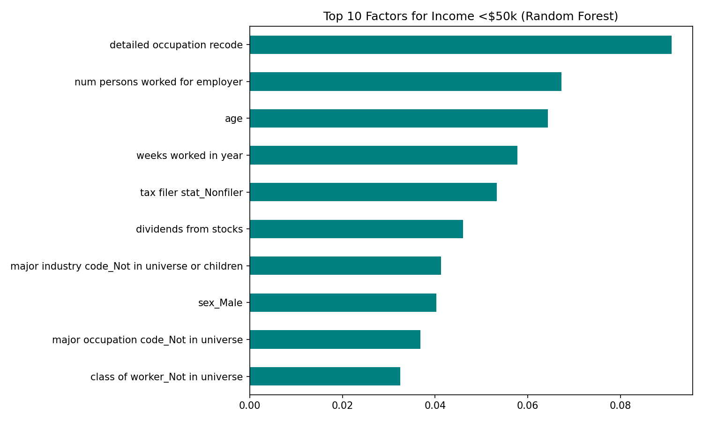 | 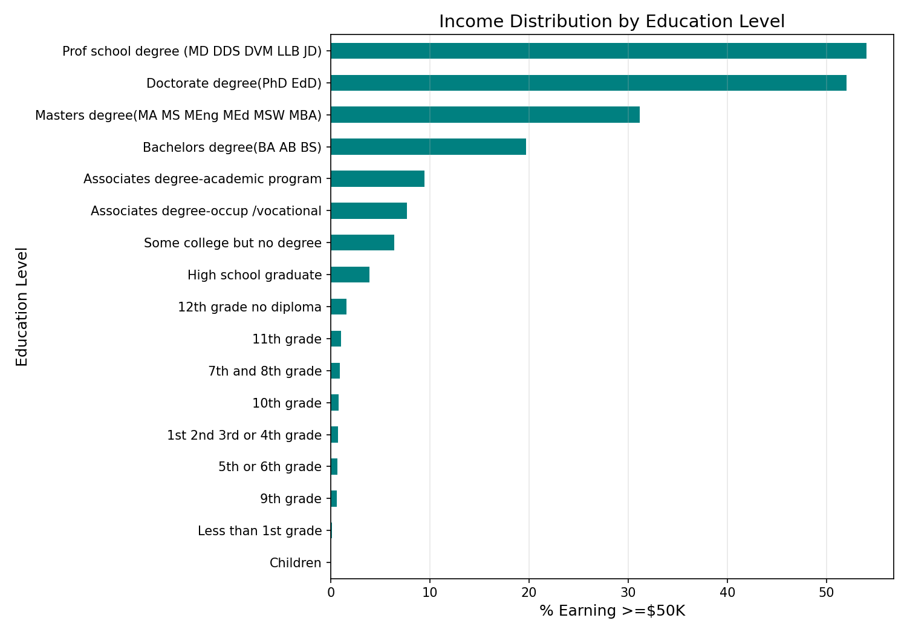 |

| **Fig 4.** XGBoost Confusion Matrix | **Fig 5.** PCA Explained Variance | **Fig 6.** Cluster Selection |
|:------------------------------------:|:---------------------------------:|:---------------------------:|
| 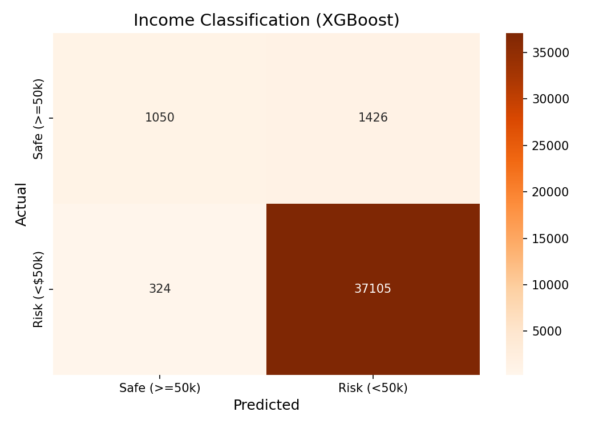 | 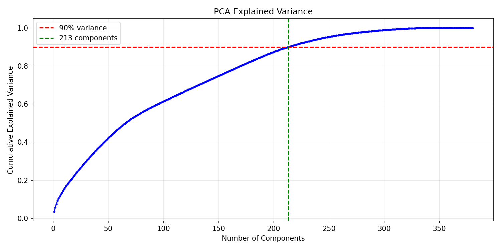 | 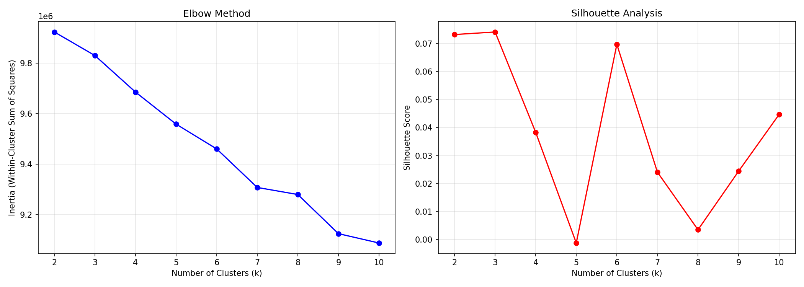 |

| **Fig 7.** Segment Sizes | **Fig 8.** Segment Comparison | **Fig 9.** Segments 2D Projection |
|:------------------------:|:-----------------------------:|:---------------------------------:|
| 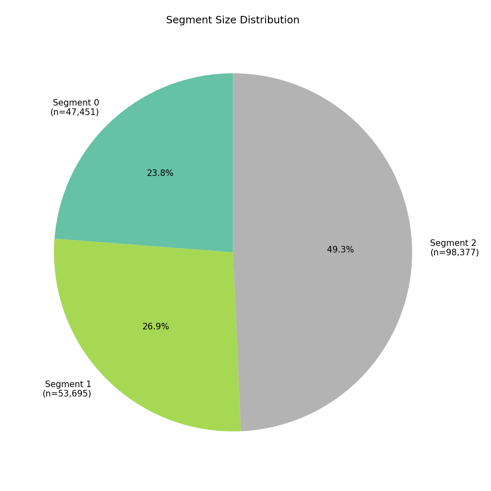 | 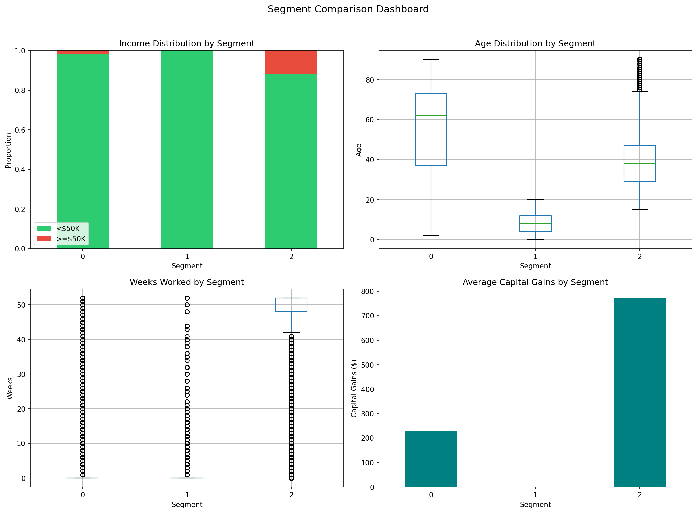 | 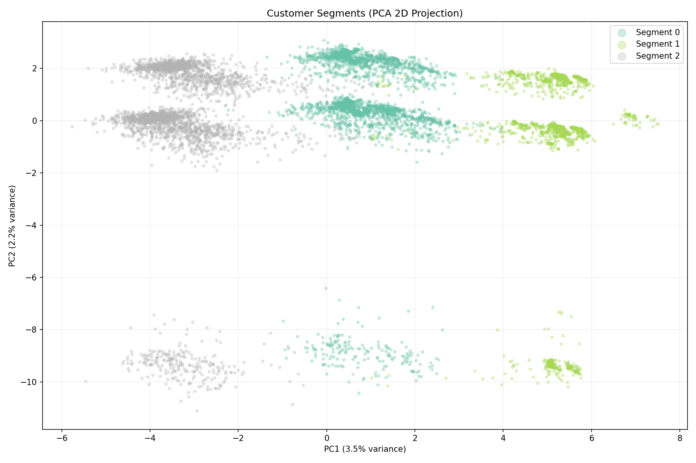 |

| **Fig 10.** Workforce Sub-Segmentation | **Fig 11.** Workforce 2D Projection |
|:--------------------------------------:|:-----------------------------------:|
| 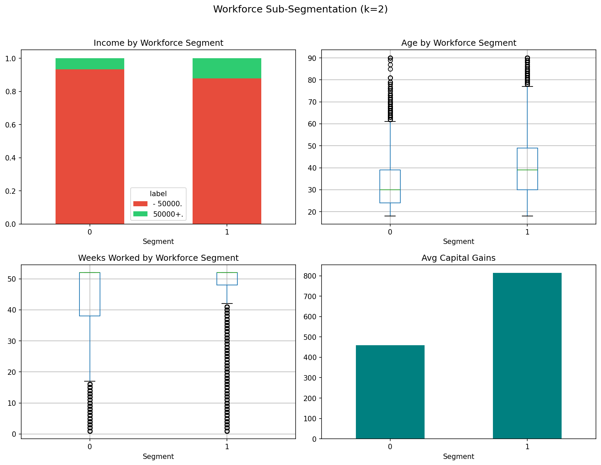 | 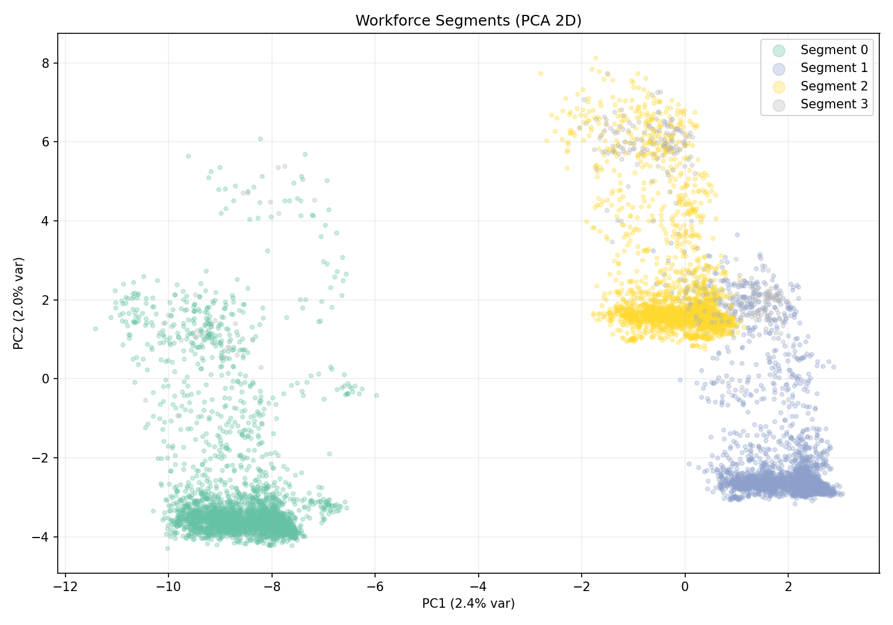 |

